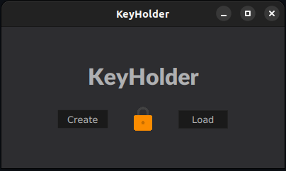
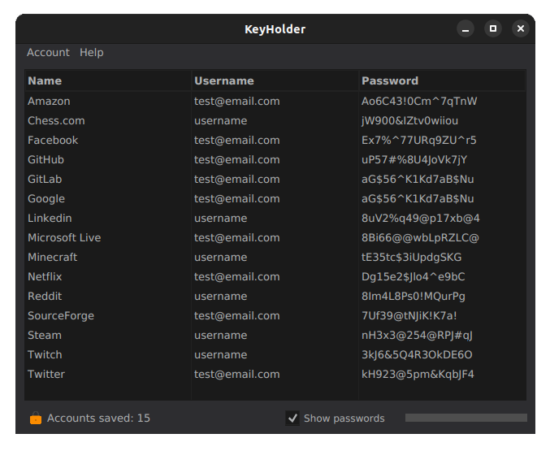
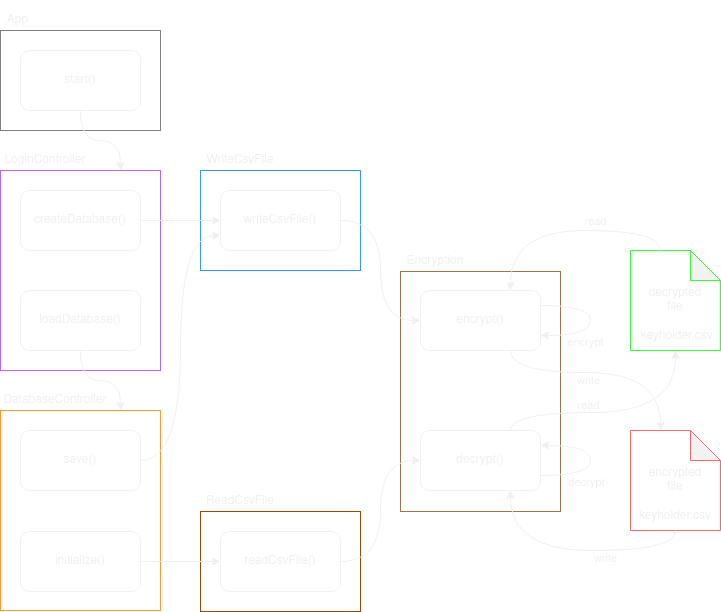

# Keyholder desktop 🔒
[]()
[]()
[]()
[]()

Store your passwords in an offline encrypted file!
<br></br>

Need a JDK to run, download it [here](https://www.oracle.com/java/technologies/downloads/)!

- Written in [Java 11](https://dev.java/) ♨️
- [JavaFX](https://openjfx.io/) GUI with [JavaFX-Dark-Theme](https://github.com/antoniopelusi/JavaFX-Dark-Theme) 🌘
<br></br>

## Download 📂
Check the [GitHub releases](https://github.com/antoniopelusi/KeyHolder-desktop/releases) section to download the executable file available in the following formats:
- `.exe`: Windows
- `.deb`: Linux (Debian Package Manager)
- `.rpm`: Linux (Red Hat Package Manager)
- `.appimage`: Linux
- `.jar`: Windows, Linux and MacOS

Feel free to compile it yourself and edit the source code:
- Download the source code
- To compile and run:
```
mvn clean javafx:run
```
- To create the jar bundle:
```
mvn clean compile package
```
<br></br>

## Features ✨
- Create an offline encrypted database to securely store your accounts data
- Choose a Master Password to encrypt the entire database
- Easily add, edit and remove the accounts
- Several keyboard shortcuts available, check the in app *help* section to find out more!
<br></br>

## Specification ⚙️
- Use *AES/ECB/PKCS5PADDING* encryption
- *SHA-256* hash to normalize password size
- *CSV* database format
- GUI developed with *JavaFX Scene Builder*
- *Maven* support for dependencies and automation
<br></br>

## Sreenshots 🖼️
Login view:



Database view:


<br></br>

## Flow diagram 🧭

