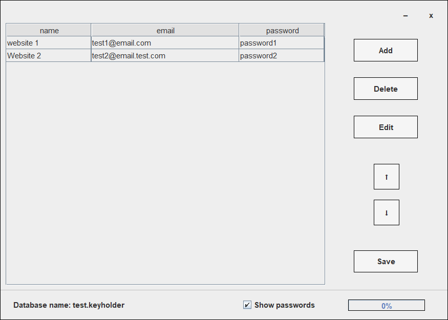

# KeyHolder
 Store password in an encrypted file locked with password
 

## `Specification`
   

#### Written in Java 8 with Eclipse IDE, can be run on all the operating systems
Need Java virtual machine to start, available [**here**](https://www.java.com/en/download/)

- Create encrypted password database
- Use a Master Password to protect it
- The database will be saved in a file with .keyloader extension
- Upload the .keyholder file in KeyHolder to read, and edit the database
- Automatically encrypt database using Advanced Encryption Standard (AES)
- Hash Master Passwords with PBKDF2 standard

## `Screenshot`
Swing GUI

